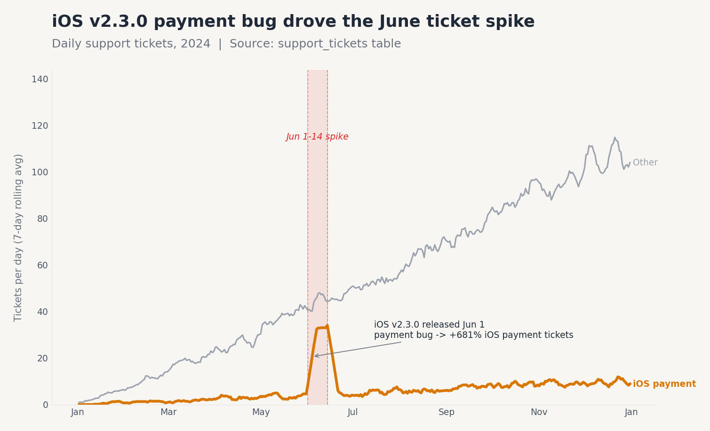

# Support ticket spike — investigation findings

**For:** VP, Engineering
**Decision:** Whether to reassign engineers in response to the recent ticket spike
**Recommendation:** **Do not broadly reassign.** Send the iOS payments engineer(s) to fix the v2.3.0 payment bug. All other categories are at baseline.
**Confidence:** A (multiple independent re-derivations agree)
**Source:** `support_tickets` table, `data/practice/novamart_practice.duckdb`, full year 2024

---

## Headline

The spike is a single product defect, not a workload-distribution problem.
**iOS app v2.3.0 (released Jun 1, 2024) carries a payment bug** that drove
**83% of the excess tickets** between Jun 1 and Jun 14. Every other category,
device, country, and acquisition channel is at or near baseline.

## Answers to your four questions

| Question | Answer |
|---|---|
| When did the spike start? | **Jun 1, 2024** (same day iOS v2.3.0 shipped). 6 contiguous days >2σ above the trailing 28-day baseline; elevated through Jun 14. The only sustained anomaly in the year. |
| Which categories drove it? | **`payment_issue` only** — accounts for 86% of the daily-rate lift (+30.9 of +35.7 tickets/day). All other categories within ±5% of baseline. |
| Which user segments are over-represented? | **None.** Country and acquisition-channel splits move proportionally with overall volume (US +83%, UK +97%, CA +114%, organic +67%, paid +63%). The over-representation is on **device + app version**, not on a user segment. |
| Trend chart? | `outputs/charts/ticket_spike_trend.png` — iOS payment in amber, all other tickets in gray, Jun 1–14 spike window shaded. |

## What the data shows

**Spike window vs. prior 28-day baseline:**

| Slice | Baseline (May 4–31) | Spike (Jun 1–14) | Lift / day | % lift |
|---|---:|---:|---:|---:|
| **Total tickets/day** | 42.6 | 78.3 | +35.7 | +84% |
| `payment_issue` | 10.9 | 41.7 | +30.9 | **+284%** |
| iOS device (any cat.) | 14.8 | 45.8 | +31.0 | **+209%** |
| iOS · `payment_issue` | 3.6 | 33.2 | +29.6 | **+816%** |
| iOS · `payment_issue` · v2.3.0 | 0 | 33.2 | +33.2 | (new release) |

**Smoking gun:** Of 584 `payment_issue` tickets in the spike window, 465
(80%) came from iOS users on app version `2.3.0` — a version that did not
exist before Jun 1.

## Validation (4 independent checks)

1. **Excess accounting** — iOS·payment alone explains 83% of the total daily excess. ✓
2. **Per-active-iOS-user rate** — rules out "more iOS users now" confound: iOS payment tickets per 1,000 active iOS users per day went from 0.64 (May) to 4.96 (spike), **+681%**. The growth in the iOS user base over those 5 weeks was only +17%. ✓
3. **Seasonality** — iOS·payment monthly volume (per day): Jan–May trends 0.6 → 3.8; June jumps to **18.1**; July reverts to 5.6 and stays in single digits. Single anomalous month. ✓
4. **Simpson's check** — within iOS only, the spike is 100% on `payment_issue`. Within `payment_issue` only, the spike is 100% on iOS. Both directions hold. ✓

## What is NOT the story (rule-outs)

- **Severity has shifted, but volume is the issue.** Critical-severity tickets did rise +212%, but that's an artifact of the same bug — payment bugs skew critical. No separate severity story.
- **TikTok-ads users appear in the spike window with 0 baseline.** This is a confound: that channel launched on Jun 1 (same day as iOS v2.3.0). It is not causing tickets — it just didn't exist before.
- **Resolution time slowed during the spike.** Indirect symptom of capacity strain; does not change the recommendation.

## Recommendation to the VP

1. **Do not reassign the broader engineering team.** Tickets in delivery, account, product-quality, and membership categories are flat. Reassigning engineers to a generic "support backlog" would solve nothing.
2. **Pull the iOS payments owner(s) onto a hotfix for v2.3.0.** Triage the 465 iOS·v2.3.0·payment tickets to identify the exact failure mode (likely a payment-flow regression introduced between v2.2.0 and v2.3.0).
3. **Roll forward to v2.4.0 or roll back to v2.2.0.** The data shows iOS·payment volume returns to single digits in July (when v2.4.0 ships per `app_versions` config), so a rollback or rapid roll-forward is the lever.
4. **Add a guardrail.** Track `iOS payment_issue tickets per 1k active iOS users / day`. Trip an alert at >2.0/day (3× current baseline) on any future release.

## Follow-ups

- **Root cause inside the app:** the support_tickets table only has metadata; the underlying defect needs an iOS engineering investigation. We can pair this analysis with the events log next.
- **Customer impact:** open tickets are 15% of spike-window iOS payment tickets vs. 5% baseline — there is still a backlog. Worth quantifying revenue at risk if you want a separate sizing.

## Provenance

- All SQL: `working/spike_detect.py`, `working/decompose.py`, `working/validate.py`
- Daily series: `working/daily_tickets.csv`
- Chart: `outputs/charts/ticket_spike_trend.png` (built with `helpers/chart_helpers.py` SWD style)
- DQ check: `working/dq_check.py` — PK clean, full year coverage, no surprising nulls
